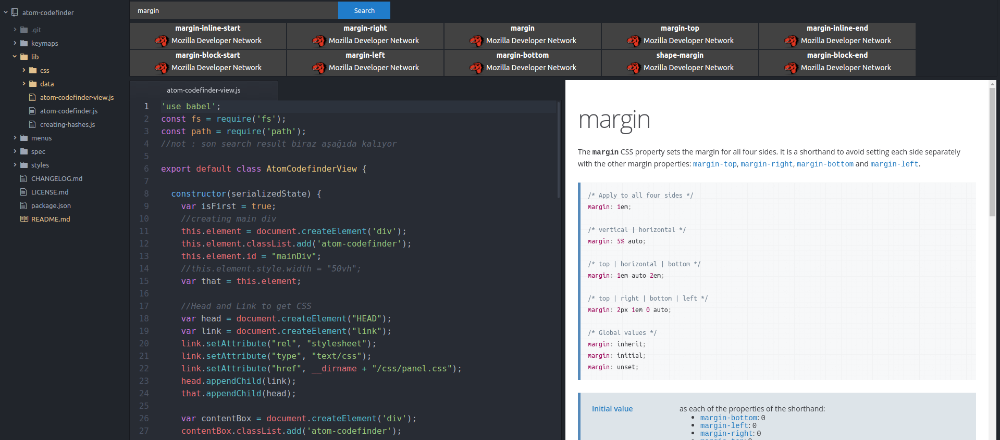

<h1 align="center"></img><BR>
</img></h1>

A tiny package that provides searchbox + panel to find references(documentations) on editor.

**works fine for 1.16.0 and older versions of Atom. under construction for newer**




## Install

``` 
apm install atom-chat
```
or install on Atom editor by searching 'atom-referenceseeker'
